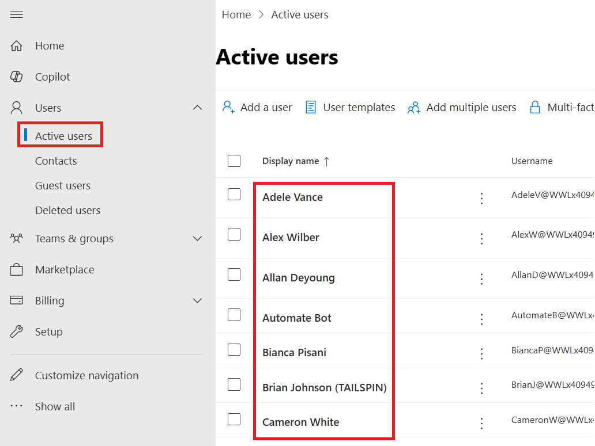

**Lab 0: Setting up lab environment**

### **Task 1: Assign** **Power Apps trial license** 

1.  Open a web browser on your VM and go to
    <https://powerapps.microsoft.com/en-us/free/> .

> 

2.  Select **Start free**.

> 

3.  Enter your **Office 365 admin credential**, check the checkbox to
    **accept the agreement** and click on **Start your free trial**.

> 

4.  Enter **password of your Office 365 tenant id** and then select
    **Sign in**.

> 

5.  Select **Yes** on **Stay signed in?** pop-up window.

> 

6.  You can now see **Home page of Power Apps.** From the environment
    selector, select the developer environment – **Dev One** which is
    created for you.

> 

7.  Open the new tab and go to Power Platform admin center by navigating
    to <https://admin.powerplatform.microsoft.com> and if required, sign
    in using your given Office 365 tenant admin credentials.

> 

8.  From the left navigation pane, select **Environments** and then you
    can see, **Dev One** is your Dataverse environment.

> 

### **Task 2: Creating Microsoft 365 Users**

1.  Navigate to the Microsoft 365 admin center using
    - [**https://admin.microsoft.com**](urn:gd:lg:a:send-vm-keys)

2.  From the left navigation, select **Users \>** **Active users** page,
    you can see the users.

> 

3.  On the **Active users** page, select the users those are having
    licenses assigned (except MOD Admin) then click on **Reset
    password**.

> 

11. To reset the same password for all the users, uncheck all check
    boxes and enter password as
    : **[Pa$$w0rd](urn:gd:lg:a:send-vm-keys)@124** and then click
    on **Reset password**.

> 

12. On the Reset password pane, click **Close**.

> 

13. Now **select all the above users** again those are having licenses
    assigned (except MOD Admin) and then click on **Manage product
    licenses**.

> 

14. On ‘**Manage product licenses’** pane, select **Assign more**, check
    the checkbox for **Microsoft Power Apps for Developer** license and
    then select **Save changes**.

> 

15. Once the licenses are assigned, select **Done**.

> 
