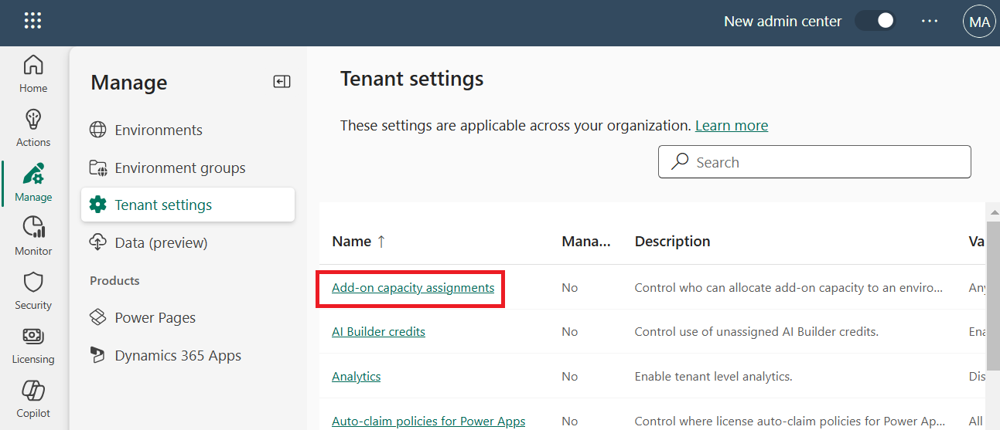

# **Lab 1: Creating and managing environments using Power Platform Admin Center**

An environment is a space to store, manage, and share your
organization's business data, apps, and flows. It also serves as a
container to separate apps that may have different roles, security
requirements, or target audiences. Power Apps automatically creates a
single default environment for each tenant, which is shared by all users
in that tenant.

### **Task 1: Setting an environment refresh Cadence**

You can indicate how often you would prefer an environment to receive
updates and features to certain Microsoft Power Platform services. You
have two options to choose from after creating an environment.

[TABLE]

To set refresh cadence:

1.  Browse to the Power Platform Admin Center
    at [**https://admin.powerplatform.microsoft.com**](urn:gd:lg:a:send-vm-keys) and
    sign in with your Office 365 tenant credentials. 

2.  From left navigation pane, select **Manage** \> **Environments** and
    then click on the **Dev One** environment.

> 

3.  Click on **Edit** in details section.

> 

4.  Under **Refresh cadence**, choose the **cadence** type –
    **Frequent** and then click on **Save** button.

> 
>
> **Note:**

- By default, environments are automatically in
  the **frequent** cadence; creating and editing canvas apps will
  receive updates once a week. When apps are published, they will
  receive the corresponding runtime version.

- If you've chosen the **moderate** cadence for the environment, all
  creating and editing of canvas apps will receive updates once a month.
  When apps are published, they will receive the corresponding runtime
  version.

### **Task 2: Control who can create and manage environments in the Power Platform Admin Center**

1.  Select the **Gear** icon  in the
    upper-right corner of the **Microsoft Power Platform** site.

> 

2.  Select **Power Platform settings**.

> 

3.  Select **Add-on capacity assignments.** 

> 

4.  Select **Only specific admins** and click **Save.**

> 

### **Task 3: Administration mode**

You can set a sandbox, production, or trial (subscription-based)
environment in administration mode so that only users with System
Administrator or System Customizer security roles will be able to sign
in to that environment. Administration mode is useful when you want to
make operational changes and not have regular users affect your work,
and not have your work affect end users (non-admins)

1.  From the left-side menu, select **Manage** \> **Environments**, and
    then select your **Dev One** environment.

> 

2.  On the **Details** page, click on **Edit**.

> 

3.  Under **Administration mode**, toggle **Disabled** to **Enabled**
    and then select **Save**.

> 

4.  On the **Details** page, click on **Edit**. Disable Administrative
    mode and **Save** it.

> 

### **Task 4 - Create a new custom security role that only has access to "Security Role" table**

1.  Open a new tab and navigate
    to [**https://make.powerapps.com**](urn:gd:lg:a:send-vm-keys). If
    required, sign in with your Office 365 tenant credentials.

2.  Select your **Dev One** environment.

> 

3.  Select your environment and click on **Settings** \> **Advanced
    Settings**.

> 

4.  **Dynamics 365** opens in separate tab. Click on **Settings \>
    Options.**

> 

5.  In the **General** tab, scroll down to the bottom and select
    the **user information** link.

> 

6.  On the user information page select the different tabs, such
    as **Summary**, **Details**, or **Administration** to see details
    about your profile.

> 

7.  Go back to **Power Platform Admin Center** tab and click on your
    environment and then click on **Settings** on top menu bar.

> 

8.  Click on **Users + permissions \> Security roles.**

> 

9.  Click on **New role.**

> 

10. In the **Role Name** field, enter a name for the new role -
    **Security update**. In the **Business unit** field, select the
    business unit the role belongs to. Select **Save**.

11. Scroll down to the **Table** list and set the **Security
    Role** table privileges as follows. Click on **Save and
    Close** button

[TABLE]

> 

### **Task 5: Assign the new security role to an administrative user**

1.  Click on **Settings** on top navigation.

> 

2.  Click on **Users + permissions - \> Users**.

> 

3.  Select an administrative user - **MOD Administrator** and then
    choose **Manage Security roles**.

> 

4.  Select the new security role which was created above and
    then **Save** it.

> 

5.  Click on **Save** to confirm the role assignment.

> 
