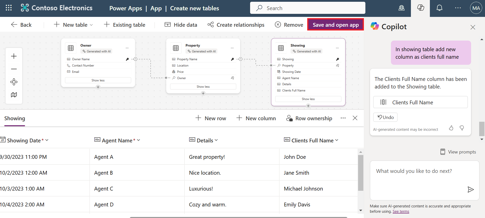
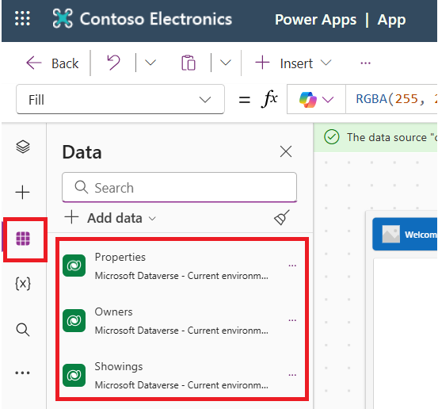
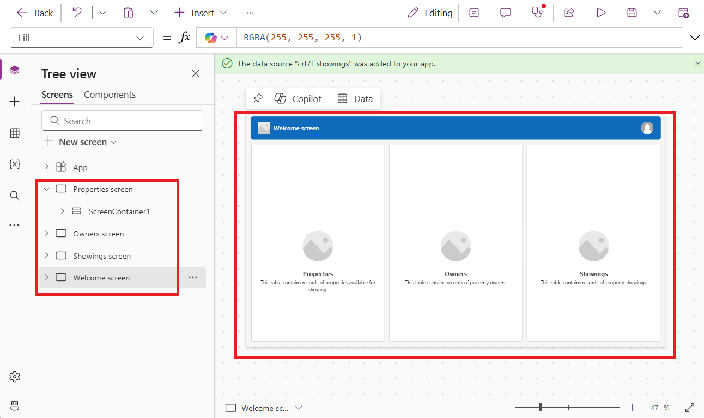
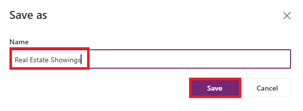
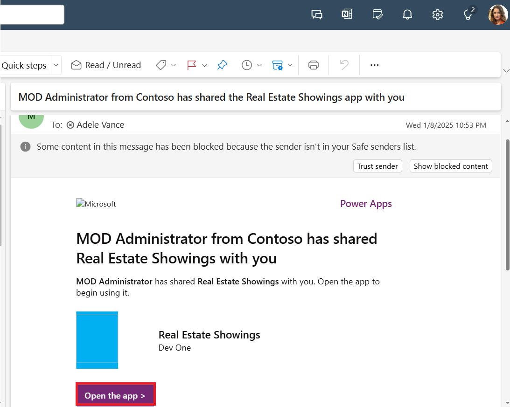

# Lab 2: Building a canvas app through conversation 

## **Task 1: Create an app with Copilot**

**Note:** In this lab, your results for data might vary from those shown
in the screenshots and images. The reason is because Power Apps uses AI
to generate data for the lab and the data changes daily.

1.  Sign into Power
    Apps [***https://make.powerapps.com/***](urn:gd:lg:a:send-vm-keys) using
    your Office 365 tenant credentials.

2.  Ensure that you are in your developer environment - **Dev One**. If
    not, click on the environment selector and select **Dev One**.

> 

3.  On the Home page in Power Apps, in the center text field, enter the
    following prompt to search for an AI-generated table:

> **Build an app to manage real estate showings**
>
> Select the **Send** button.
>
> 

4.  If you come across any pop-up, close it.

> 

5.  Copilot creates one or more Dataverse tables with data that includes
    typical real estate tasks.

> 

6.  To see more information, click on three dots above the table and
    select **View data**.

> 

7.  You can now see the columns in the Showing table.

> 
>
> Your next steps are to modify and add to the already generated table.

8.  Now click on the **Showing table** and then in the text box, in the
    lower part of the Copilot pane to the right of the screen, enter the
    following text and select the **Send** button.

> **Rename Feedback column as Details**
>
> This will rename Feedback column as Details in the showings table.
>
> 

9.  Now click on the **Showing table** and then in the text box, in the
    lower part of the Copilot pane to the right of the screen, enter the
    following text:

> In showing table add a new column as client full name
>
> This will add a column in the showings table. Select
> the **Send** button.
>
> 

10. Select **Save and open app**.

> 

11. Again, select **Save and open app** on **Done working?** pane.

> 

12. When the app first loads, a dialog might appear stating “**Welcome
    to Power Apps Studio”**. If so, select the **Skip** button.

> 

13. The app that has been built for you should show in **Edit** mode.

> 

14. For the better view, close the Copliot pane.

> 

15. Select the **Data** icon from the left navigation bar. Copilot has
    created a **Dataverse** table that's now displaying in
    the **Environments** section.

> 
>
> \*\*Note: \*\*Currently, Copilot is only supported for Dataverse. You
> can't use any other data access point at this time.

16. Select the **Tree view** from the left navigation bar. You can see
    the **Welcome screen** is opened in the canvas and other remaining
    screens are listed under the Tree view on left side.

> 

17. Click on **Showings screen** in the **Tree view** and you can see
    the screen is now opened.

> 

18. From the upper part of your screen, select the **Save** button to
    save the new app that you created.

> 

19. Give the app name as **Real Estate Showings** and select **Save**.

> 

## **Task 2: Test the app**

1.  Select the **Play** button from the upper part of the screen to test
    the app.

> 

2.  In the left pane, select the **+New** button.

3.  Fill in the fields with the following information and then select
    the check mark in the upper-right corner of the screen.

> **Showing:** Showing 6
>
> **Showing Date:** Enter any future date
>
> **Time:** 09:00
>
> **Agent Name:** John Almeda
>
> **Details:** Spacious
>
> **Property:** Select any from the suggestions.
>
> 

4.  To close the test window, select cross mark at the top right corner
    of the screen.

> 

5.  You will be navigated to the editing window. Select **Ok** on the
    ‘**Did you know**’ pop-up window.

> 

6.  To publish the app, select **Publish** button on from the top right
    of the screen.

7.  Select **Publish this version**.

8.  Select **\<- Back** to go back on the home page.

> 

9.  Select **Leave**.

> 

## **Task 3: Share the app with user**

1.  Select **Apps** from left navigation pane, select **Real Estate
    Showings** app and then select **Share** from above horizontal
    palette.

> 

2.  Type Adele and then select Adele Vance from the suggestions.

3.  Now select **Share**.

4.  Open Outlook account of the Brooke Gray with Login id -
    <adelev@wwlx409494.onmicrosoft.com> and Password – **Pa$$w0rd@124**.
    You can see the mail received from MOD Admin. Select **Open the
    App**.

> 

5.  You can see the app.

