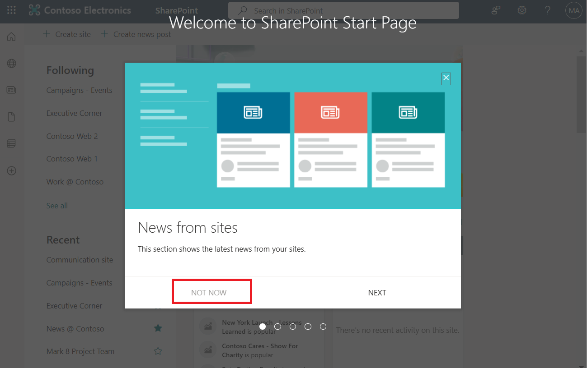

# **Lab 3: Creating a flow using the cloud flows designer with Copilot (preview)**

## **Task 1: Create a flow using Copilot**

1.  Sign in to <https://make.powerautomate.com/> with your Office 365
    admin tenant credentials.

2.  Select **Dev One** environment from environment selector.

> 

3.  In the text box under Create your automation with copilot, type
    ‘**When a new item is created in SharePoint, send me an email**’ and
    then click on **Generate** button.

> 

4.  Copilot will suggest a flow as per your description.

> 

5.  For this scenario, you need to first create a List in SharePoint. In
    power Automate, click on **App launcher** at the top left. Select
    **SharePoint**.

> 

6.  You can observe that you are signed in with your Office 365 tenant
    credentials. Select **Not now** on the Welcome pop-up.

> 

7.  Select **+Create site** on SharePoint Home page.

> 

8.  Select **Communication site**.

> 

9.  On **Select a template** page, scroll down and click on **Blank**
    template.

> 

10. Click on **Use template**.

> 

11. Enter **Site name – Testing**, **site description – Training**, keep
    the generated site address as is and then select **Next**.

> 

12. Select **English** as site language and then select **Create site**.

> 

13. Select **+New \> List**.

> 

14. Select **Blank list** under Create a list.

> 

15. Enter the **List name -Mylist** and select **Create**.

> 

16. Go back to the Power Automate window.

17. Review the AI generated flow suggestion and select **Next**.

> 

18. Review your connected apps and services and select **Create flow**.

> 

19. For a better view, close the Copilot pane.

> 

20. Select **When an item is created** step.

> 

21. To finalize your flow, configure the required settings. Under the
    **Site address** field, click on dropdown menu and select
    **Testing** site address.

> 

22. For the **List Name**, select **Mylist** from the dropdown and then
    select Collapse icon to close the pane.

> 

23. Now, select the third step – **Send an email**.

> 

24. Under Send an email, you can see **Subject** and **Body** part are
    already generated by the copilot. Select Collapse icon to close the
    pane.

> **Note:** In case subject and body parts are not generated by copilot
> then you can type as shown in the below figure.
>
> 

25. Select **Save** to save the flow.

> 

## **Task 2: Test the flow**

1.  Select **Test** to test the flow.

> 

2.  Select **Manually** and then select **Test**.

> 

3.  To run the flow, create an item in the list in SharePoint.
    Considering you are on **Testing site \> Mylist** page, select
    **+Add new item**.

> 

4.  Enter **Testitem** under **Title** and then click on **Save**.

> 

5.  Your flow is running now, to check the status, come back to Power
    Automate portal, click on back arrow **\<-** appearing before the
    name of the flow.

> 

6.  Select **Got it** on **Your flow is ready to go** pop-up window.

> 

7.  You can see the status **Succeeded** under the run history. If you
    don’t see the status, refresh the window.

> 

8.  You can also check the Email received to the MOD Admin. Select App
    launcher from the top left on Power Automate page. Select
    **Outlook**.

> 

9.  You can see the Email.

> 
