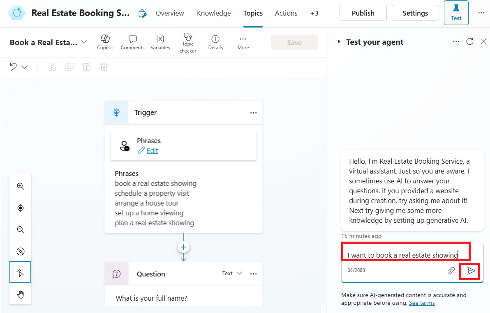

# **Lab 4: Building agents with generative AI**

1.  Sign into **Microsoft Copilot Studio** with your **Office 365 admin
    tenant** credentials
    using [**https://copilotstudio.microsoft.com/**](urn:gd:lg:a:send-vm-keys)

2.  If asked, select **United States** as your country/region and then
    select **Start free trial.**

> 

3.  Select **Dev One** environment from environment selector.

> 

4.  On the **Welcome to Copilot Studio** pop-up, select **Skip**

> 

5.  Select **+Create** from the left navigation menu and then
    select **New agent.**

> 

6.  Select **Skip to configure**.

> 

The Create an agent wizard opens. This wizard helps you set up your
agent by naming it, selecting the language, and also optionally choosing
if you want to boost your conversations with generative answers.

7.  Name your bot as **Real Estate Booking Service** and then click
    on **+Add knowledge.**

> 

8.  Select **Public website**.

> 

9.  Under the webpage link, enter
    the [**https://powerplatform.microsoft.com/**](urn:gd:lg:a:send-vm-keys) and
    then select **Add**.

> 

10. You can see the link added under Webpage link field, now again
    select **Add**.

> 

11. Select **Create**.

> 

12. With your agent created, select **Topics** from the above horizontal
    pallet and then select the **+ Add a topic** dropdown menu.
    Select **Create from description with Copilot**.

> 
>
> **Note:** If the **Create with Copilot** option doesn't display, you
> might need to enable Intelligent authoring support:
>
> a\. Select the **Settings** icon in the upper menu and then
> select **General settings**.
>
> b\. Set the **Intelligent authoring support with Copilot** toggle
> to **On**.

13. A new window appears asking you to **Name your topic** and provide a
    description in the **Create a topic to...** space. In the **Name
    your topic** field, enter the following text:

> [**Book a Real Estate Showing**](urn:gd:lg:a:send-vm-keys)

14. In the **Create a topic to...** field, enter the following text and
    then select **Create**.

> collect a user's full name, email, address of the property, and date
> and time of the showing
>
> 
>
> A new topic displays with the generated trigger phrases.
>
> 
>
> **Note:** Remember, your generated content might appear differently
> than what's shown in this lab.
>
> Multiple question nodes, entity selection, and variable naming should
> also be displayed.
>
> 

15. Select **Save** to save your changes.

> 

17. From the right side of the screen, select **Test** and ‘Test your
    agent’ pane will open.

> Note: Close the ‘Edit with copilot’ pane for more visibility.
>
> 

18. In the Test your agent pane, enter the following trigger phrase and
    click on send icon.

> **I want to book a real estate showing**
>
> 

19. [The agent responds with the "What is your full name?" question, as
    shown in the following image.](urn:gd:lg:a:send-vm-keys)

> 

20. Enter the rest of the information:

> **Full name:** \<Your name\>
>
> **Email address:** \<Your email address\>
>
> **Address:** 555 Oak Lane, Denver, CO 80203
>
> **Date and Time:** 10/10/2025 10:00 AM
>
> 

21. To test the ‘add knowledge’ property, enter What is Microsoft Power
    Platform? The agent retrieves information from the website which we
    have provided while creating an agent and returns a response.

> 
