# **Lab 5 - Implementing Security and Governance**

Many customers wonder how can Power Platform be made available to their
broader business and supported by IT? **Governance** is the answer. It
aims to enable business groups to focus on solving business problems
efficiently while complying with IT and business compliance standards.
The following content is intended to structure themes often associated
with governing software and bring awareness to capabilities available
for each theme as it relates to governing Power Platform.

## **Exercise 1: Control user access to environments: security groups and licenses**

### **Task 1: Create a security group and add members to the security group**

1.  Open new tab in the same browser and navigate to **Microsoft 365
    admin
    center** using [**https://admin.microsoft.com**](urn:gd:lg:a:send-vm-keys).
    Sign in with your Office 365 tenant credentials.

2.  Select **Teams & groups** \> **Active teams & groups**.

> 

3.  Select **Security group** tab and then select **+Add a security
    group**.

> 

4.  Add the group Name: [**PPS-security**
    and** Description:**](urn:gd:lg:a:send-vm-keys) Power Platform
    architecture and governance security group and then click **Next**.

> 

5.  Click on **Next** on Edit settings window.

> 

6.  Click on **Create group** button.

> 

7.  Click on **Close** button to close the window.

> 

8.  Select the group you created, select **Members** tab and then click
    on **View all and managed members** hyper link.

> 

9.  Click on **+ Add members**.

> 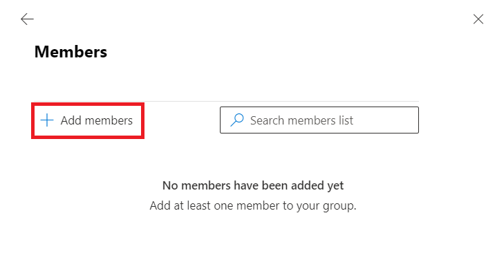

10. Select the first three users (For example here, Adele, Alex and
    Allan) to add to the security group and then select **Add(3).**

> 

11. **Close** the ‘Members’ pane to return to the **Groups** list.

> 

12. You have completed this task, please do not close the tab and 
    proceed ahead with the next task.

**Task 2: Associate a security group with a Dataverse environment**

1.  Open new tab and navigate to Power Platform admin center
    using [**https://admin.powerplatform.microsoft.com**](urn:gd:lg:a:send-vm-keys) and
    if required, sign in with your Office 365 tenant credentials. 

2.  Enable the toggle switch for ‘Try new admin center’.

> 
>
> 

3.  In the navigation pane, select **Manage \>** **Environments**, and
    then select **+New**.

> 

4.  On the New environment window, enter the following information.

> **Name:** Test
>
> Region: United States – Default
>
> Type: Trial
>
> Add a Dataverse data store: Yes
>
> 
>
> 

5.  Dfdf

> 

6.  Under the **Restricted access**, select **PPS-Security** and then
    select **Done**.

> 

7.  You can see under Security group, PPS-security group is added and
    then select **Save**.

> 
>
> You have completed this task, do not close the browser and proceed
> ahead with the next Exercise.

## **Exercise 2: Evaluate impact of adding DLP**

**Scenario**

In this exercise, you will be creating an environment, creating a flow,
and then viewing the impact of adding a DLP policy.

Task 1: Create a trial environment

1.  Switch back to **Power Platform Admin Center** tab or navigate
    to [**https://admin.powerplatform.microsoft.com**](urn:gd:lg:a:send-vm-keys) and
    sign in with your Office 365 tenant credentials.

2.  Select **Environments** and click **+ New**. Enter below details.

    - **Name -**  [**DLP-policy trial env**](urn:gd:lg:a:send-vm-keys)

    - **Region –** United States - default

    - **Type** - Trial

    - **Add a Dataverse data store**  - Yes and click **Next**.

> 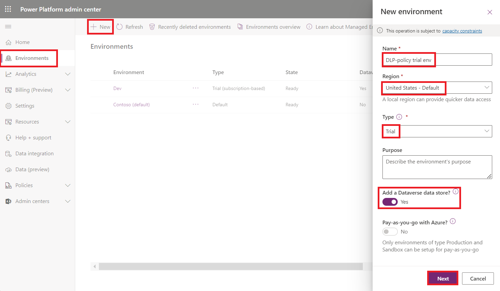

3.  Enter the following details.

[TABLE]

> 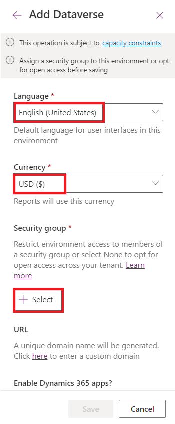

4.  Select **None** under Open access security group and then click on
    **Done**.

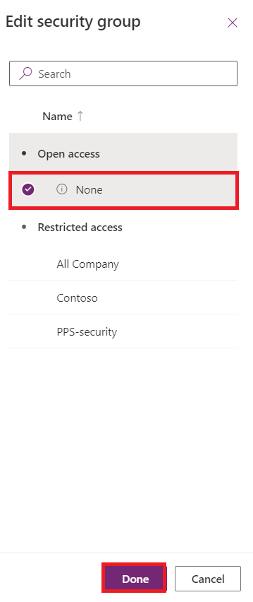

5.  Click on **Save**.

> 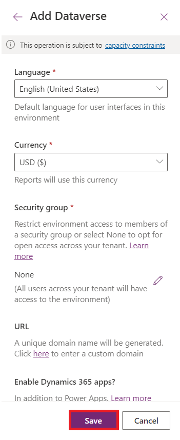

6.  Wait for the environment to be created. The state will change
    to **Ready** when the environment is ready.

> 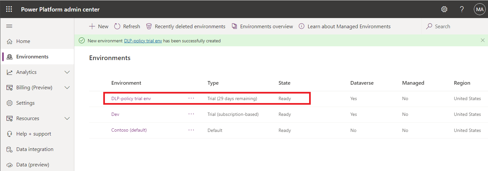

7.  You have completed this task, without closing the tab, proceed ahead
    with the next task.

**Task 2: Create a flow to get the weather**

1.  Switch back to **Power Apps maker
    portal** [**https://make.powerapps.com**](urn:gd:lg:a:send-vm-keys) tab
    and make sure you have signed in with your Office 365 tenant
    credentials. 

2.  Select the trial environment – **Test**.

> 

3.  Select **Flows** from the left. Click **+ New** **flow** and
    select **Scheduled cloud flow.**

> 

4.  Enter [**Weather flow**](urn:gd:lg:a:send-vm-keys) for **Name**,
    select **Repeat every 1 Day**, and click **Create**.

> 

5.  Click **+ New step**.

> 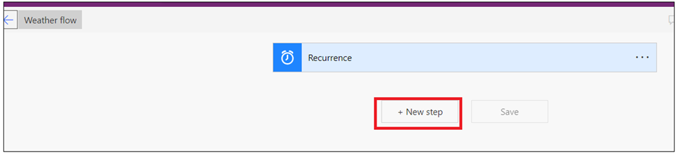

6.  Search msn and select **Get current weather** **MSN Weather**.

> 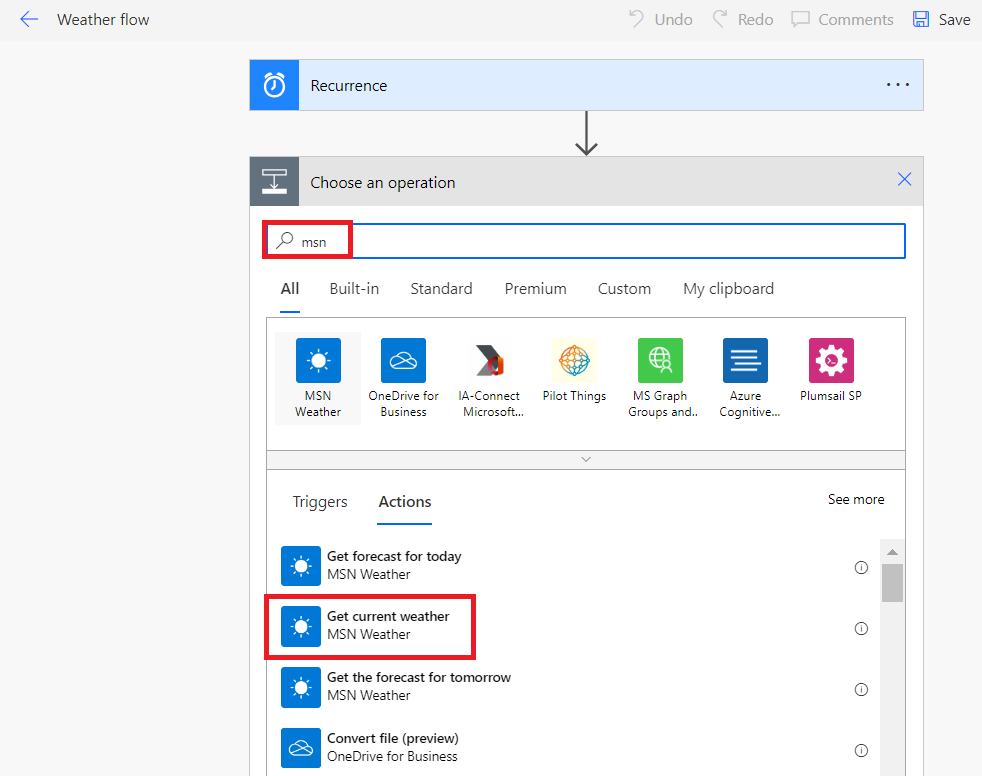

7.  Provide your **Location - Denver**, select U**nits - Imperial**, and
    click **+ New step**.

> 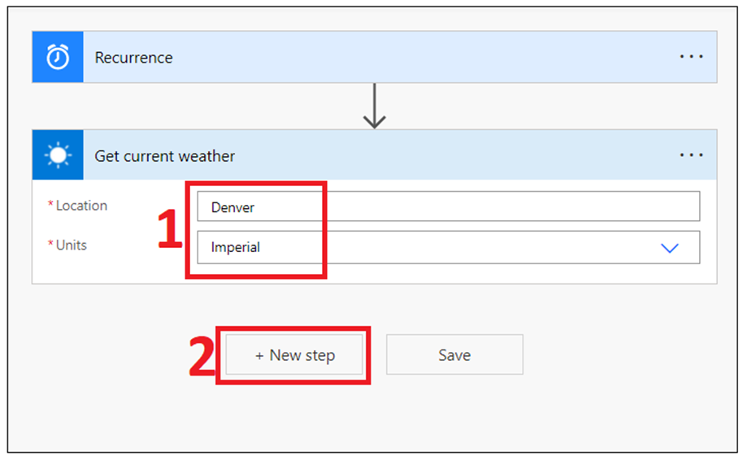

8.  Search for **send email** and select **Send an email (V2) Office 365
    Outlook**.

> 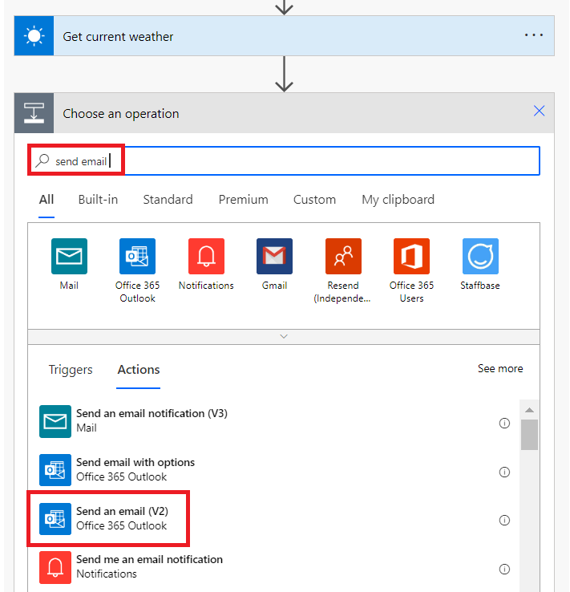

9.  Provide your email for **To** and enter [**Current
    Weather**](urn:gd:lg:a:send-vm-keys) for **Subject**.

10. Click on the Body enter [**Current weather
    for:**](urn:gd:lg:a:send-vm-keys) and select **Location** from the
    Dynamic content pane.

> 

11. Hit the **\[ENTER\]** key,
    enter [**Temperature:**](urn:gd:lg:a:send-vm-keys) and
    select **Temperature** form the Dynamic content pane.

12. Hit the **\[ENTER\]** key,
    enter [**Conditions:**](urn:gd:lg:a:send-vm-keys) and
    select **Conditions** form the Dynamic content pane.

13. You may add other values to the email.

> 

14. Click **Save**.

> 

15. Go to **Flows** by clicking on the back arrow located on the top
    left of the page.

> 

16. Click **Flow name** to open the flow.

> 

17. Make sure the flow is On. Select **Turn on**, if the flow is turned
    off.

> 

18. Click **Run** and then click **Run flow**.

> 
>
> 

19. Click **Done** and wait for the flow run to complete.

> 

20. Click on the Refresh button to see the update status.

> 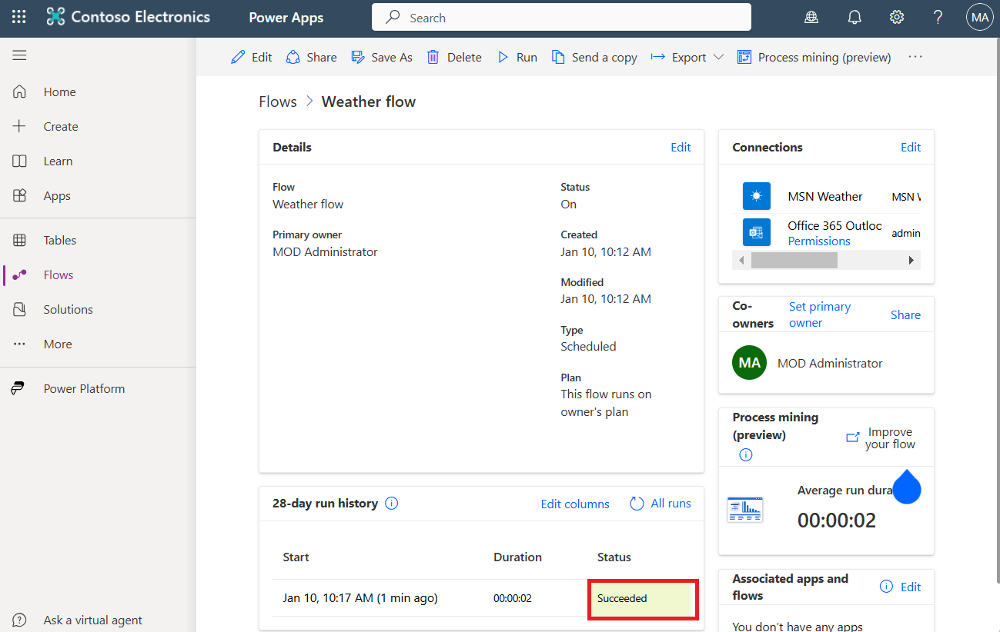

21. Open new tab and browse
    to [**https://outlook.office.com**](urn:gd:lg:a:send-vm-keys). sign
    in with <christiec@wwlx409494.onmicrosoft.com> and
    Password: **[Pa$$w0rd](urn:gd:lg:a:send-vm-keys)@124**

22. You should get an email with the weather information.

> 

23. You have completed this task, please do not close the tab. Proceed
    ahead with the next exercise.

**Task 3: Create a DLP Policy**

In this task you will create an environment specific DLP and see how it
impacts your working flow.

1.  Switch back to **Power Platform admin center**
    [**https://admin.powerplatform.microsoft.com**](https://admin.powerplatform.microsoft.com) tab
    and make sure you have signed in with your Office 365 Admin tenant
    credentials.

2.  Ensure that you are using new admin center. If not, then enable the
    toggle switch for ‘Try new admin center’.

> 

3.  Select **Security** from left navigation pane. Select **Access
    control** and then select **Data policy**.

> 

4.  Click **+ New Policy**.

> 

5.  Enter name of the policy **- PP-Datapolicy** and click **Next**.

> 

6.  Search for [**Dataverse**](urn:gd:lg:a:send-vm-keys) ,
    select **Microsoft Dataverse**, and click **Move to Business**. 
    Choose carefully, you may have to expand the Name column to
    differentiate between connectors in your search results.

> 

7.  Search for **SharePoint**, select **SharePoint,** and click **Move
    to Business**.

> 

8.  Search for **Outlook**, select **Office 365 Outlook,** and
    click **Move to Business**.

> 

9.  Select the **Business** tab and you should now have three connectors
    moved to Business. Click **Next**.

> 

10. Do not add any connectors and click on **Next**.

> 

11. In **Scope**, select **Add multiple environments** and then
    click **Next.**

> 

12. Select your **Test** trial environment and then click on **+Add to
    policy**.

> 

13. Select **Added to policy** tab and then click **Next**.

> 

14. **Review** the policy and then click on **Create policy**.

> 

15. Your **Policy** got created.

> 

16. Click on **App Launcher** and then select Outlook.

> 

17. You should see an **Alert** email saying **Flow suspended due to
    violation of Data Loss Prevention policy** ( It takes 5 min to
    generate email)

> 

18. Switch back to **Power
    Apps** [**https://make.powerapps.com**](urn:gd:lg:a:send-vm-keys) and
    if required, sign in with your Office 365 tenant credentials.

19. Select **Flows**, select **Weather flow**.

> 

20. Flow should now be suspended because of the DLP you created. Click
    on it to open the flow.

> 

21. You should not be able to **run** the flow.

> 
>
> **Note:**  After you finish this lab if you have time come back and
> modify the DLP you created to fix the problem.  If you have trouble
> getting it to work, ask your instructor for some tips.

22. You have completed this task, please do not close the browser.
    Proceed ahead with the next task.

## **Exercise 3: Microsoft Dataverse teams management**

**Task 1: Access your team's page**

1.  Switch back to the **Power Platform Admin Center** tab or navigate
    to [**https://admin.powerplatform.microsoft.com**](urn:gd:lg:a:send-vm-keys) and
    make sure you have signed in with your Office 365 admin tenant
    credentials.

2.  Select **Manage** from left navigation pane. Select Environments and
    then click on your **Test** trial environment.

> 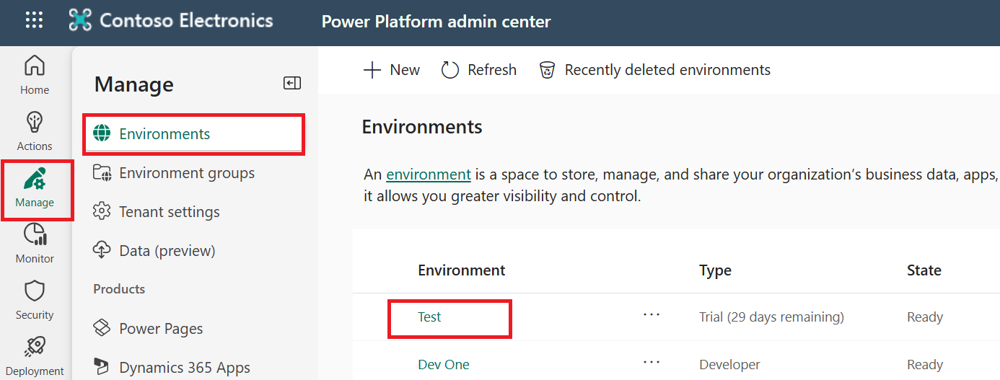

3.  Click on **Settings** on top menu bar.

> 

4.  Select **Users + permissions** \> **Teams**.

> 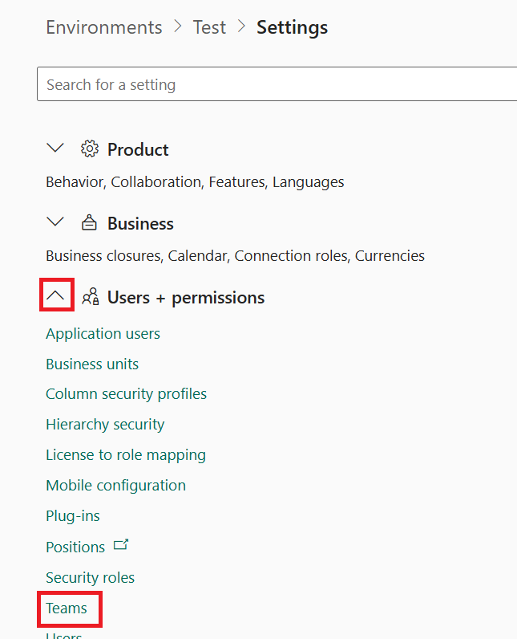

5.  A list of all the teams in the environment is displayed.

> 

**Task 2: Create a new team**

1.  Select **+ Create team**.

> 

2.  Specify the following fields:

    - **Team name:** [**PPS -Test- Team**](urn:gd:lg:a:send-vm-keys)

    - **Description:** Power Platform

    - **Business unit:** Type org and select it from suggestion box

    - **Administrator:** Your Office 365 admin tenant. Type admin and
      select it from suggestion box

    - **Team type:** **Microsoft Entra ID Security Group**

    - **Group name:** PPS-security

    - **Membership type:** Members and guests

    - Click **Next**

> 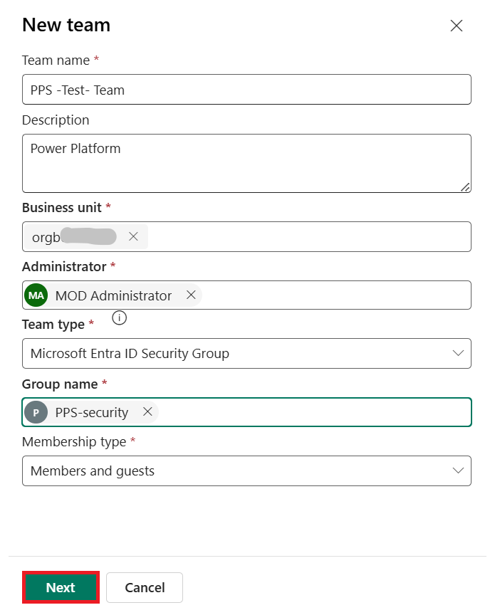

3.  On the Manage security roles pane, scroll down and select **System
    administrator** role and then click on **Save**.

4.  Again click on **Save**.

> 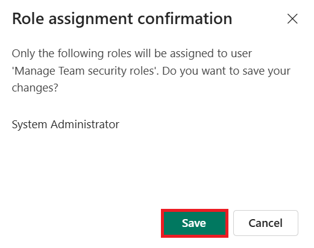
>
> 

**Task 3: Manage the security roles of a team**

1.  Select the checkbox for a recently created team – **PPS-Test-Team**.
    Select **Manage security roles**.

> 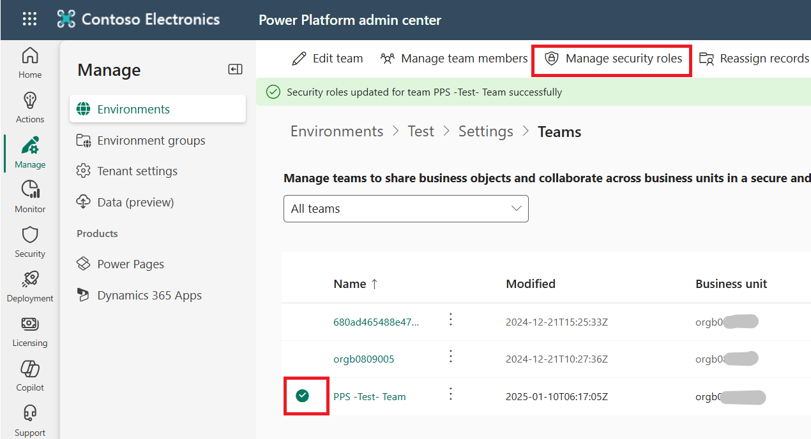

2.  Select **AIB SML Roles**, and then click **Save**.

> 
>
> 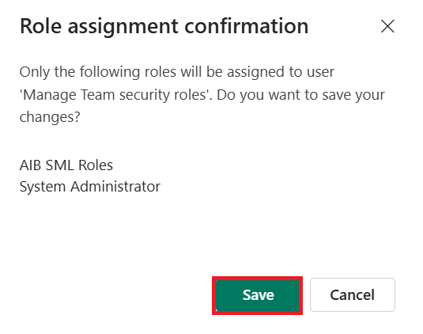

3.  You have completed this task, please stab back in the same tab and
    proceed ahead with the next task.

**Task 4: Delete a team**

1.  Select the checkbox for a team name. Select **Delete** twice to
    confirm. Note that this action can't be undone.

> 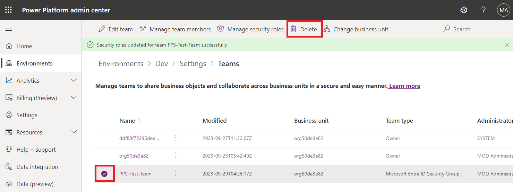
>
> 

2.  You have completed the exercise, please do not close the browser.
    Proceed ahead with the next lab.
