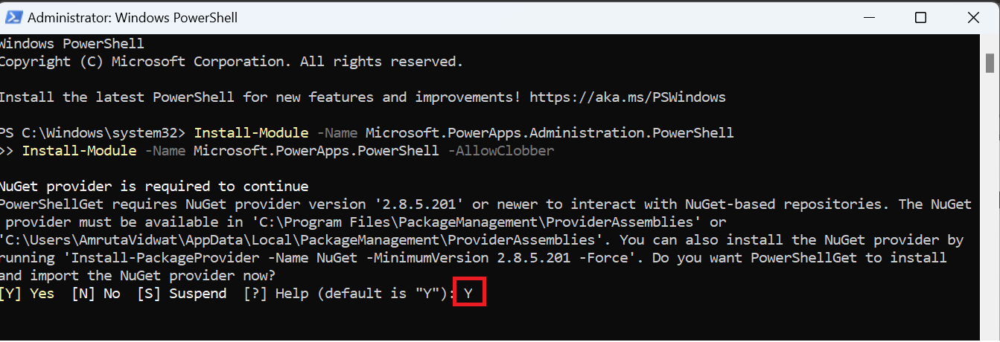

# **Lab 6: Managing a custom connector with a DLP policy**

### **Task 1: Publish a custom connector**

1.  Locate the **PowerPlatformConnectors-dev** zip file stored in
    **C:\Labfiles**. Right-click the file in Windows Explorer and
    select **Extract All...**

> 

2.  Go to the extracted folder and open
    the **PowerPlatformConnectors-dev** folder.

3.  Open the **custom-connectors** folder.

> 

4.  Open the **Office365Groups** folder.

> 

5.  Make a note of the location of
    the **apiDefinition.swagger.json** file. You will need this file
    when you create your custom connector in subsequent steps.

> 

6.  Go to the [Power Automate maker
    portal](https://flow.microsoft.com/) <https://make.powerautomate.com/>
    in a web browser and sign in with your Office 365 tenant
    credentials.

7.  From the environment picker, select the **Test** environment. By
    selecting this environment, your custom connector will only be
    deployed in this environment and will not be available in your
    default environment.

> 

8.  Within the left navigation pane, select **More** and then
    select **Discover all.**

> 

9.  Select **Custom connectors**.

> 

10. Select **+ New custom connector** and then **Import an OpenAPI
    file**.

> 

11. Enter **Custom Office 365 Groups** in the **Connector name** column.
    In the **Import an OpenAPI file** column, click on **Import** and go
    to the C:\Labfiles and locate **apiDefinition.swagger.json** file
    from the path mentioned in Task 1, Step 5.

> 

12. Select **Continue**.

> 
>
> The custom connector publisher wizard will now be displayed. You do
> not need to complete actions on the **General** tab.

13. Select the **Security** tab and then select an Authentication type
    of **No authentication**.

> 

14. No further actions are necessary on the **Definition, Code, AI
    Plugin (Preview)** or **Test** tabs, so select the **Create
    connector** link to publish your connector.

> 

15. In the upper-left corner, a message will briefly appear indicating
    that your custom connector has been published. Select
    the **Close** label to complete publishing the custom connector.

> 

16. You should now see your custom connector available within
    the **Custom connectors** experience.

> 

You have now published your custom connector. In the next topic, you
will manage this custom connector in a DLP policy.

### **Task 2: Manage a custom connector in a DLP policy**

**Note:** Currently, a custom connector cannot be managed through the
Power Automate Admin center's DLP experience without some administrative
actions. In this section, you will use the [Microsoft Power Apps and
Power Automate PowerShell
cmdlets](https://learn.microsoft.com/en-us/power-platform/admin/powerapps-powershell/) for
administrators.

To add a custom connector to a DLP policy, you will need to retrieve
some unique identifiers for your custom connector and DLP policy to
provide them as inputs when adding your custom connector. These steps
are also covered in the following section.

1.  Launch **Windows PowerShell** and select **Run as Administrator**.

> 

2.  Import the required modules by using the following commands:

> **Install-Module -Name Microsoft.PowerApps.Administration.PowerShell**
>
> **Install-Module -Name Microsoft.PowerApps.PowerShell -AllowClobber**
>
> 
>
> 

3.  Enter **Y** to select Yes.

> 

4.  If you are prompted to accept the change to
    the *InstallationPolicy* value of the repository, accept **\[A\] Yes
    to all modules** by entering **A** and then selecting **Enter** for
    each module.

> 

5.  If again you are prompted to accept the change to
    the *InstallationPolicy* value of the repository, accept **\[A\] Yes
    to all modules** by entering **A** and then selecting **Enter** for
    each module.

> 

6.  List all your DLP policies by running the following command in
    the **Windows PowerShell** command-line
    tool: **Get-AdminDlpPolicy**.

> 
>
> **Note:** You will be prompted for credentials at this point. Ensure
> that the credentials you are using have Environment or Tenant
> Administrator permissions.
>
> 
>
> Note: If you get error after executing this step, execute the given
> command and then Accept **\[A\] Yes to all**
>
> Set-ExecutionPolicy -ExecutionPolicy Unrestricted
>
> 

7.  A list of DLP policies will be displayed. Look for the DLP policy
    that you created in the previous lab - PPDatapolicy. When you find
    the policy, copy the **PolicyName**, which is represented as a GUID,
    to a text editor like Notepad.

> 

8.  You now need to retrieve more details about your custom connector.
    To do so, enter **Get-AdminPowerAppConnector** in the **Windows
    PowerShell** command-line tool. When the results have returned, copy
    the **ConnectorName** and **ConnectorId** values to a text editor.

> 

9.  Enter **Add-CustomConnectorToPolicy** in the Windows PowerShell
    command-line tool.

10. When prompted, provide the **PolicyName** that you copied in step 5.

11. Provide the **ConnectorName** value that you copied in step 6.

12. Provide the **GroupName** of **hbi** to put it into the **Business
    data only** data group. Use **lbi** if you would rather put the
    custom connector in the **No business data allowed** data group.

13. Provide the **ConnectorId** that you copied in step 6.

14. You will now be prompted to provide a **ConnectorType**. Provide a
    value of **Microsoft.PowerApps/apis**.

> 

15. Your command should now run and you should be presented with a
    status **Code** of **200** and a **Description** of **OK**.

> 
>
> **Note**: Currently, you will not be able to rename the custom
> connector from this experience.
