## Lab 7: Exploring Capacity storage model and analytics from the Microsoft Power Platform admin center

### Task 1: Explore the Power Platform Admin View app

1.  Switch back to **Power Platform admin center** tab or open new tab
    and navigate
    to [**https://admin.powerplatform.microsoft.com**](urn:gd:lg:a:send-vm-keys) and
    sign in with your Office 365 tenant credentials. 

2.  Ensure that you are using current Power Platform admin center and
    not the new admin center. Expand **Resources** and
    select **Capacity**. Notice the **Storage capacity usage**.

> 

3.  Go to the **Top storage usage by environment** section and notice
    the capacity usage by top environments.

> 

4.  Click to select the **Trial** tab. See where storage is being used
    across your trial environment.

> 

5.  Select **Details** icon next to your Test environment.

> 

6.  This page provides a view of the capacity storage used by your trial
    environments. Trial environment capacity usage doesn't count towards
    your organization's Dataverse usage.

> 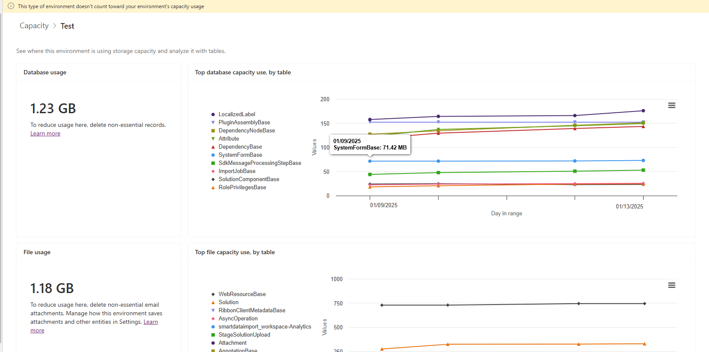

7.  Come back to the **Capacity** page by selecting **Capacity** from
    the path.

> 

8.  Select **Download** above the list of environments to download an
    Excel .CSV file with high-level storage information.

> 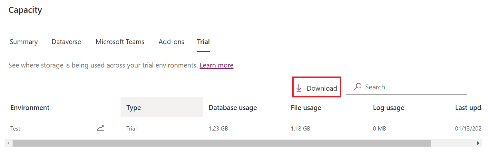

9.  Click **Open file**. You should see high-level storage information.

> 

10. Close the CSV file.

11. Expand **Analytics** and select **Dataverse.**

> 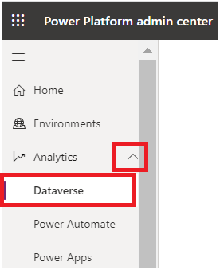

12. On **Dataverse analytics** page, click **Change filters**.

> 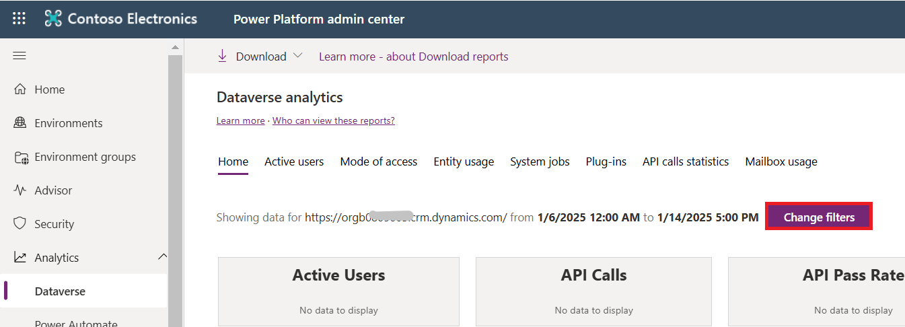

13. On **Filters** page, select **Dev One** environment **URL**. Change
    the date range to between **one-week ago** and **today**, and then
    click **Apply**.

> 

14. The visuals should change to reflect your changes.

> 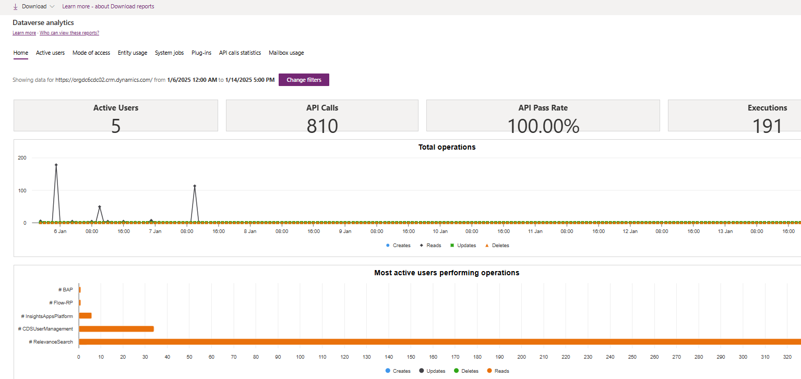

15. Select **Power Automate**.  Select **change filters**.

> 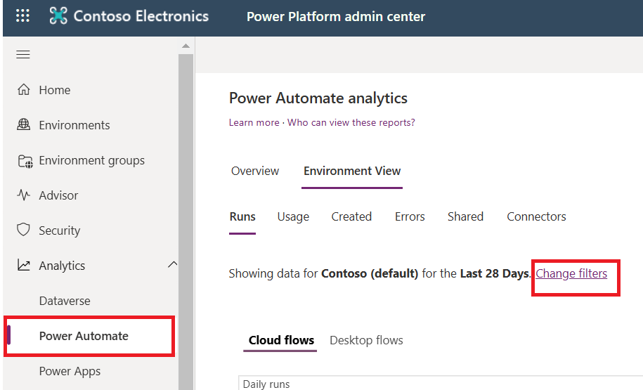

16. On **Filters** page, select the **Dev One** environment where we
    have created cloud flow and then **Apply**.

> 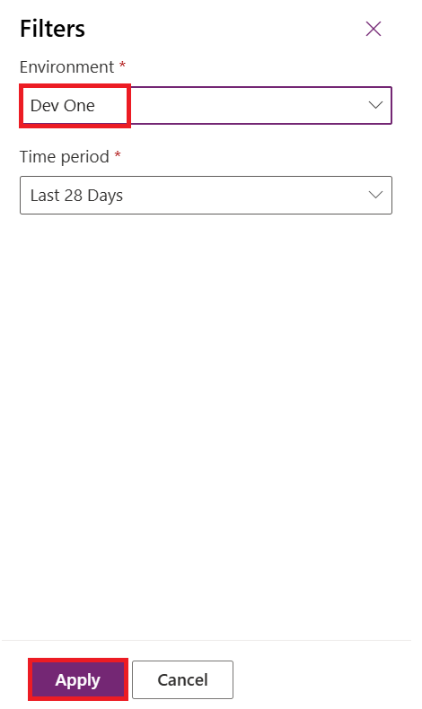

17. Review the visuals in the **Runs** tab and then select
    the **Usage** tab.

> 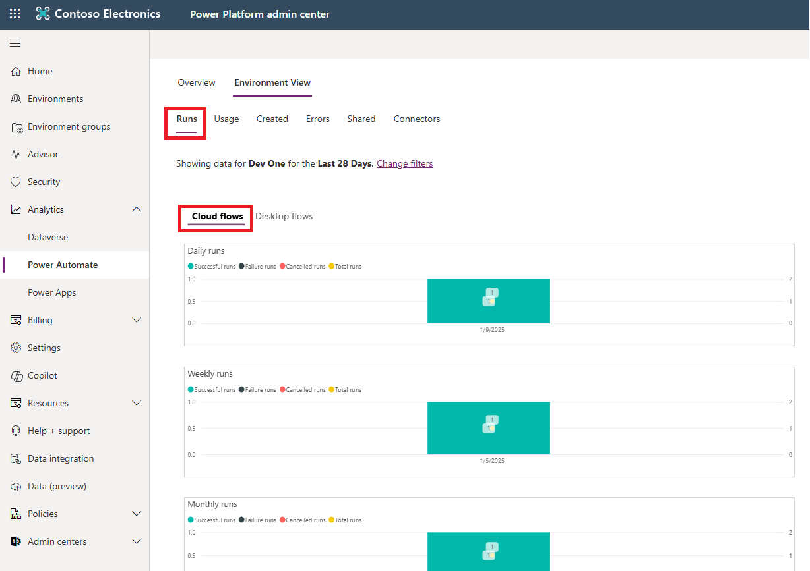

18. Review the visuals in the **Created** tab.

> 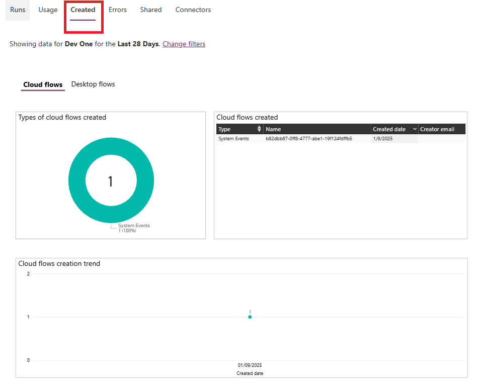

19. Select **Power Apps,** select **Change filters**.

> 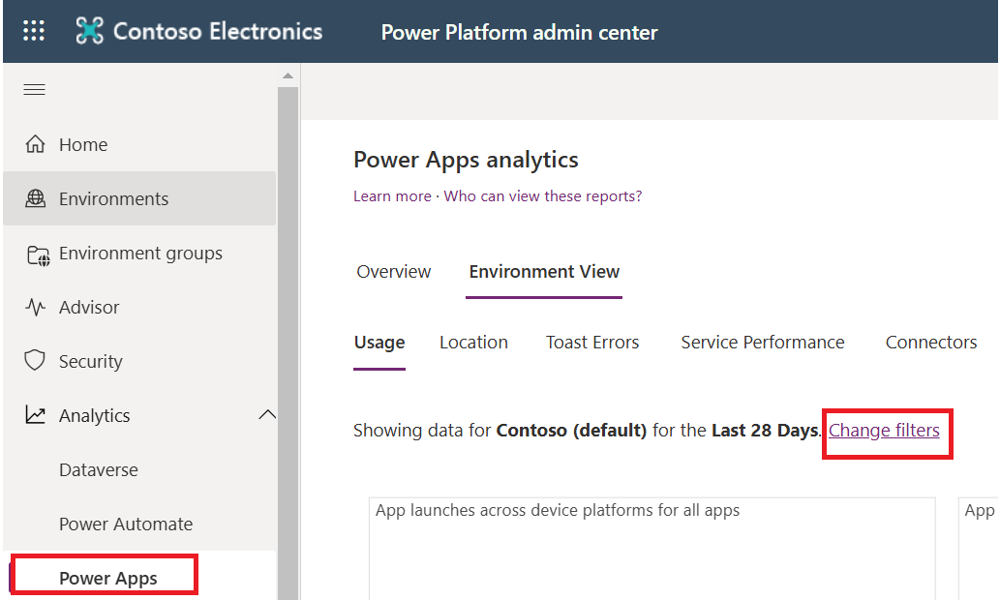

20. Select **Dev One** environment and then select **Apply**.

> 

21. Review the visuals in Usage tab.

> 

22. You have completed this task, please do not close the browser .
    Proceed ahead with the next exercise.

### Task 2: Enable tenant-level analytics

1.  Select the **Overview** tab. Select **Enable** to redirect to
    the **Analytics** pane.

> 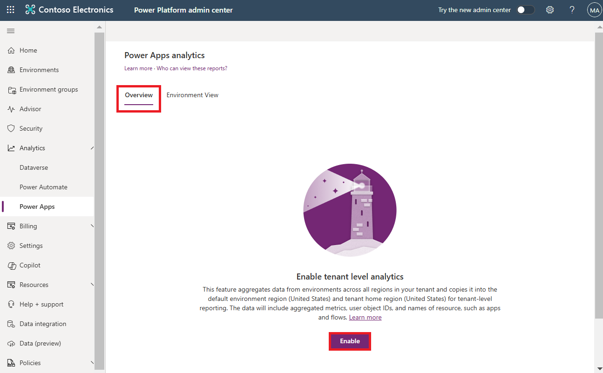

2.  In the **Analytics** pane, grant consent for tenant-level analytics
    by enabling the **Tenant-level analytics** feature. Select **Save**.

> 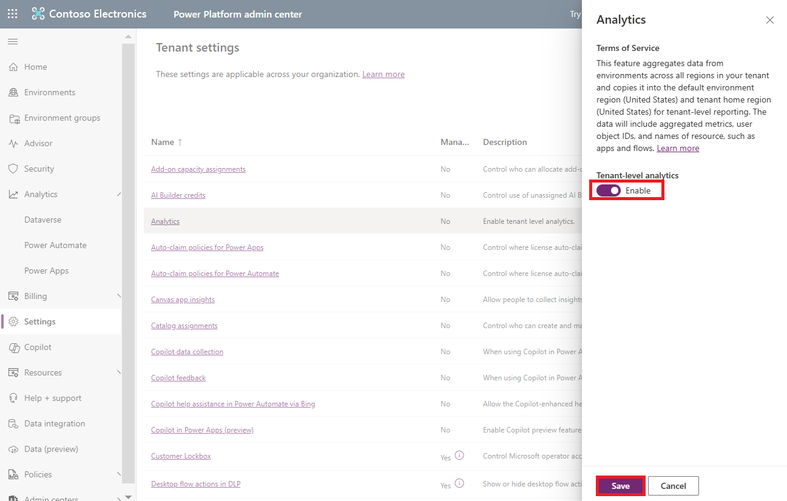

3.  From left navigation pane, select **Analytics** \> **Power Apps.**

4.  The **Overview** tab displays a message indicating that tenant-level
    analytics has been enabled. Typically, these reports are displayed
    within 24-48 hours of enabling the feature.

> 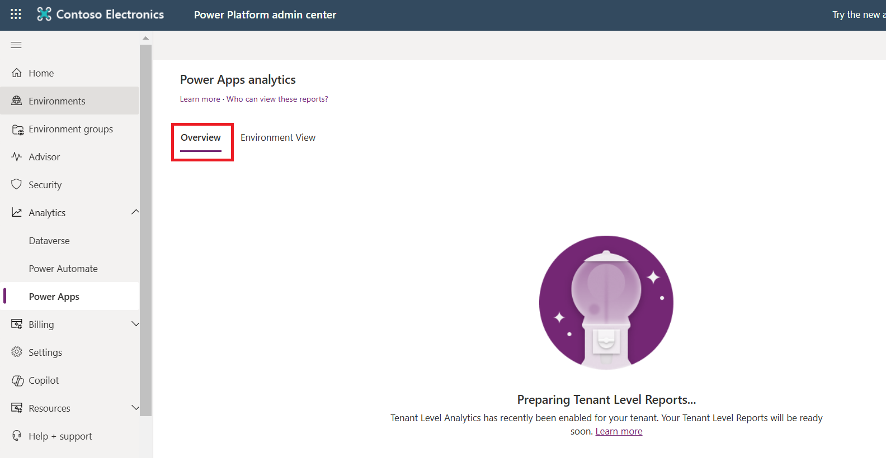

5.  Considering that the feature has got enabled. Select **Usage** tab.
    Power Apps reports provide insights into tenant and environment
    usage and inventory of all apps and connector.

> 

6.  To see Maker Activity report, select Maker activity tab. You can see
    the following details on the report.

- What is the total number of apps created/published/modified/deleted by
  app makers across the tenant or environments?

- What is the count of first-time makers across canvas and model-driven
  apps?

- Who are the top makers across the tenant or environments?

- What is the total number of connections consumed in one or more
  environments?

> 

7.  To review, Inventory report, select App inventory.

- What is the total number of model-driven and canvas apps across the
  tenant or environments?

- Which apps depend on specific connectors?

- Who are the owners of the apps hosted in one or more environments?

- What is the distribution of canvas versus model-driven apps across the
  organization?

> 

8.  Select **Analytics** \> **Power Automate.**

> 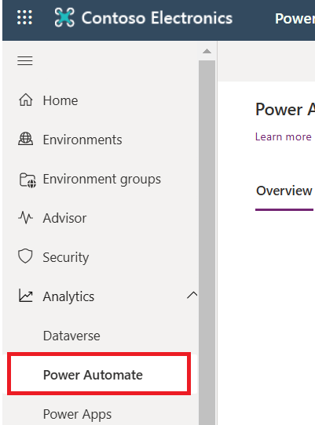

9.  Select **Maker activity** tab.

> 

10. Select **Inventory** tab.

> 
