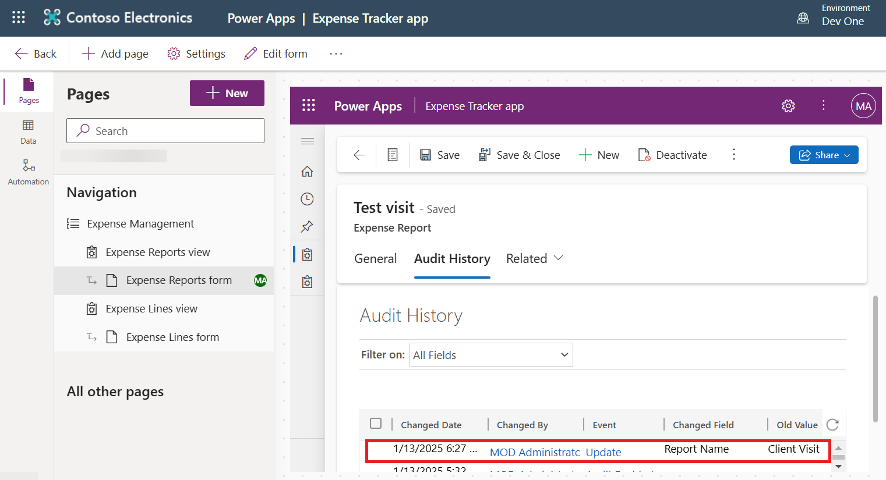

# **Lab 8: Manage Dataverse auditing**

## Exercise 1: Manage Dataverse auditing

### **Task 1: Start/stop auditing for an environment and set retention policy**

1.  Sign in to the Power Platform admin center using
    **[https://admin.powerplatform.microsoft.com](urn:gd:lg:a:send-vm-keys)**
    with your Office 365 admin tenant credentials.

2.  Select **Manage \>** **Environments** from left navigation.

> 

3.  Select **Dev One** environment and then select More commands (three
    dots) from above horizontal palette and then select **Settings**.

> 

4.  Expand **Audit and logs** \> **Audit settings**.

> 

5.  Select **Start auditing** and **Read log** checkbox. Set the
    retention policy for the logs as **90 days**. Select **Save**.

> 

[TABLE]

> **Note:** When the audit retention period is set to Forever, logs will
> never be deleted.

6.  You have completed this task, please do not close the browser.
    Proceed ahead with the next task.

### **Task 2: Configure auditing for one or more tables and columns in Power Apps**

1.  Go to **Power Apps** portal
    using [https://make.powerapps.com](https://make.powerapps.com/) and
    sign in with your given Office 365 Admin tenant credentials.

2.  Click on the environment selector and select **Dev One** environment
    that contains a Dataverse database.

> 

3.  Select Tables from left navigation pane and then click to open
    the **Expense Report** Table.

> 

4.  Select **Columns** under Schema.

> 

5.  Locate and click to open the **Expense Report** column.

> 

6.  Expand the **Advanced options** section. Select the** Enable
    auditing **checkbox and then click on **Save**.

> 

7.  To go back to Expense Report, select **Expense Report** from the
    path.

> 

8.  Select **Edit** from the command bar.

> 

9.  On the command bar, select **Edit table properties**.

> 

10. Expand **Advanced options**.

> 

11. Select the **Audit changes to its data** checkbox. Select **Save**.

> 

12. Select back arrow to go back to the

> 

13. Select **Advanced** from the command bar and then select **Publish
    table**.

> 

14. Wait till you see the message as **Publish succeeded**.

> 

### **Task 3: Test auditing**

1.  Select **Apps** and click to launch the **Expense Tracker
    app** application.

> 

2.  You can see, you are in the Expense Reports tab, select **Client
    Visit** report.

> 

3.  Change the name **Client visit** to **Test visit** and then select
    **Save**.

> 

4.  Click **Related** and select **Audit History**.

> 

5.  You should see the change history for each of your changes.

> 
