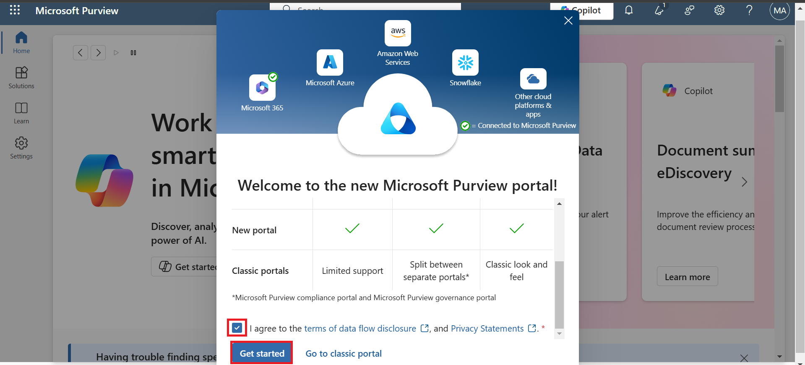
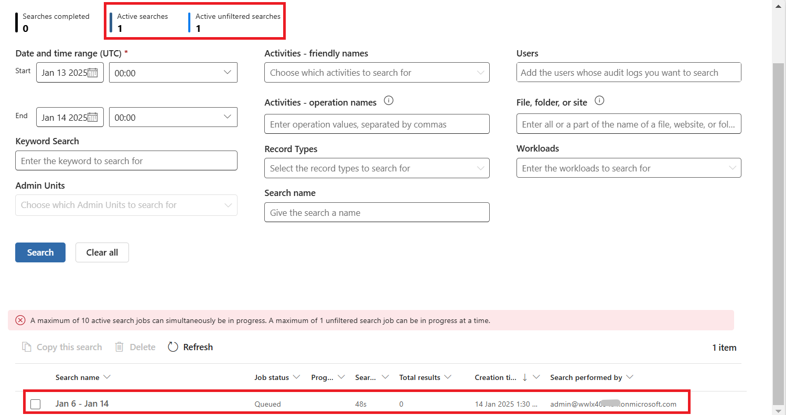

# Lab 8: Activity logging

1.  Sign in to the Microsoft Purview portal using 
    <https://purview.microsoft.com/> with your Office 365 tenant
    credentials.

2.  Accept the **terms and privacy statement** and then click on **Get
    started**.

> 

3.  From the left navigation pane, select **Solutions** and then select
    **Audit.**

> 

4.  Select **Search** from left navigation pane.** **Click on **Start
    recording user and admin activity**.

> 

5.  Configure **Start date** as 3-4 days before the current date and
    **End date** as current date. Select **Search**.

> 

6.  You can see the number of Active searches and Active unfiltered
    searches is changed from 0 to 1. Scroll down a little and you can
    also see the search log.

> 

7.  Click on Refresh and you can see the job status as **Completed**.

> 
